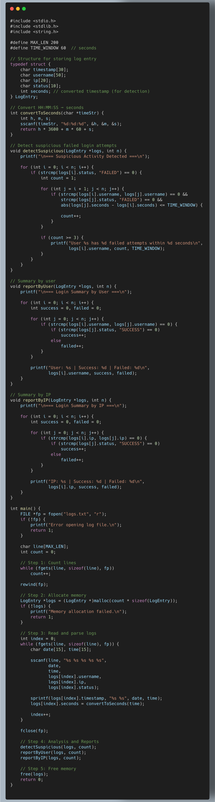
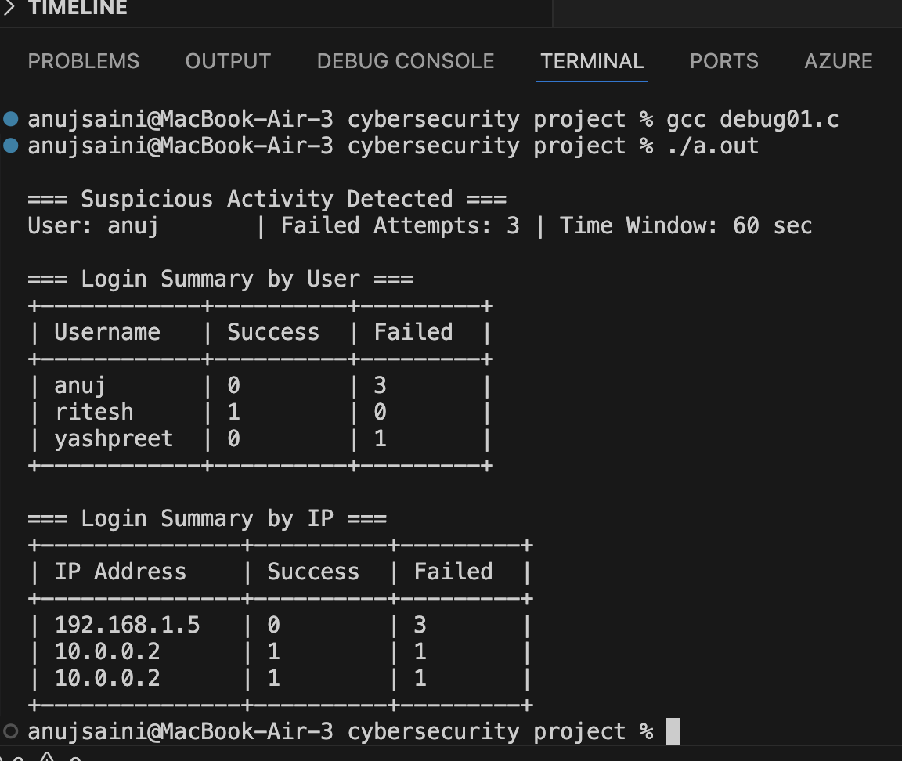

# Nimbus_Project_ANUJ-SAINI_43

## 🔹 Main Program File
The main executable file of this project is:

**`executable.c`**

Please compile and run this file to execute the program.

👉 [Click here to open the main file (`executable.c`)](executable.c)

Cybersecurity teams monitor system logs for anomalies such as failed logins or intrusion attempts. 
 
Author - ANUJ SAINI

Project Overview Cyber Security Log Analyzer is a C-based project developed by Anuj Saini to detect suspicious login activity within system event logs. The program parses raw log entries containing timestamps, usernames, IP addresses, and login status, storing them using dynamically allocated structures. It analyzes patterns such as repeated failed login attempts within a short time window—an essential indicator of brute-force or intrusion attempts. The system also generates detailed summary reports by user and IP, highlighting successful and failed logins. This project demonstrates core concepts from the C programming syllabus, including string handling, pointers, dynamic memory allocation, arrays, functions, and file I/O, while applying real-world cybersecurity principles to build a practical anomaly-detection tool.

Objectives & Features 
✔️ Key Features Parse system log files with timestamp, username, IP, and status Store log entries in dynamically allocated arrays of structures Detect suspicious users with multiple failed login attempts in a short time window Generate reports: Summary by user Summary by IP address List of suspicious accounts Modular functions for parsing, counting, and reporting Uses pointers, dynamic memory, arrays, file I/O, and string functions

🧩 Technologies & Concepts Used This project applies key syllabus topics:
✔ Problem Solving 
✔ String Handling 
✔ Arrays & Dynamic Memory 
✔ Functions & Modular Programming 
✔ Pointers 
✔ File I/O 
✔ Real-world Cybersecurity Concepts

Screenshot:

